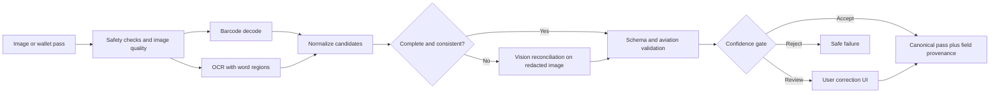
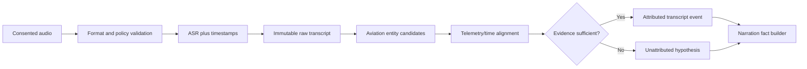
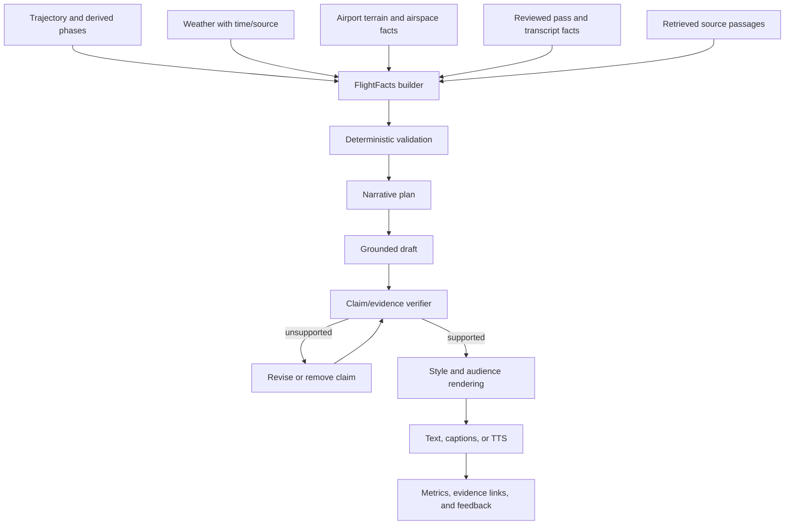
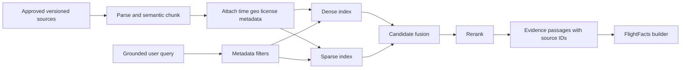
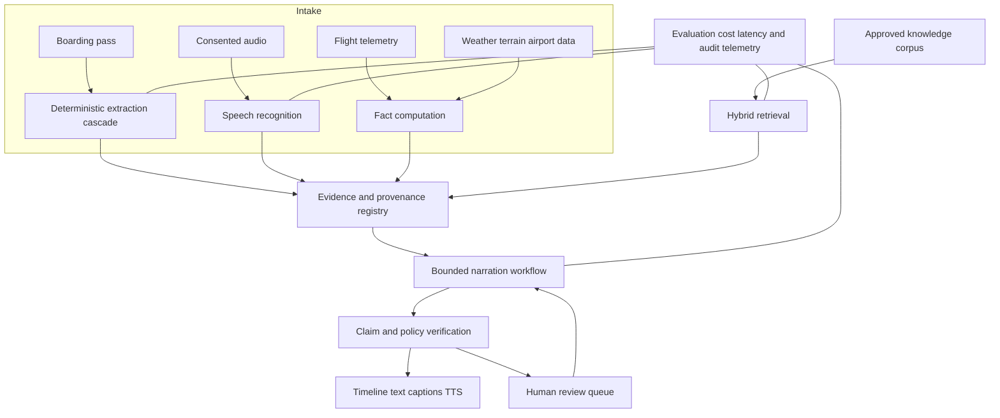

# AeroTwin AI capability evaluation

**Status:** Research recommendation (not an implementation specification)  
**Research snapshot:** 2026-08-07  
**Scope:** Cloud OCR, boarding-pass extraction, managed Whisper/ASR, LangGraph,
flight narration, hosted vision models, and hosted embeddings

**Deployment constraint:** Cloud AI services only; no self-hosted model inference

## Executive recommendation

AeroTwin should use a **deterministic-first, confidence-gated pipeline**, not a
single multimodal prompt. Decode the boarding-pass barcode first, use OCR for
visible text, and call a vision model only to reconcile missing or ambiguous
fields. Validate every candidate against an explicit schema and aviation rules;
retain provenance and confidence at field level.

For narration, build a verified `FlightFacts` package from telemetry, weather,
terrain, airport, and retrieval results before generating prose. LangGraph is a
good fit once the workflow needs durable checkpoints, review interrupts, or
branching recovery. It is unnecessary for the first linear prototype. Whisper
is relevant for user-supplied commentary or lawful recordings, but **must not be
presented as a source of official ATC truth**. Use embeddings for discovery and
retrieval, never for exact identifiers, chronology, or safety-critical facts.

### Recommended stack by phase

| Capability | Prototype | Production candidate | Why |
|---|---|---|---|
| Boarding-pass intake | Barcode decoder + managed OCR | Barcode decoder + managed OCR + selective vision fallback | Barcode payloads are structured; the cascade controls cost and hallucination |
| OCR | Benchmark two managed document services | Best measured cloud OCR with a second cloud fallback where justified | Layout, mobile-photo robustness, regional availability, and contracts matter more than a generic leaderboard |
| Speech recognition | Managed transcription API | Best measured managed ASR endpoint | Keeps model serving, scaling, and upgrades with the cloud provider |
| Workflow | Plain typed pipeline | LangGraph when durable/reviewable state is justified | Avoid orchestration complexity before branching and recovery exist |
| Narration | One-pass grounded draft with citations | Plan → draft → verify → render graph | Separates factual correctness from style |
| Vision | One provider behind an adapter | Primary plus evaluated fallback | Model churn and provider incidents should not alter the domain contract |
| Embeddings | Hosted general-purpose text embedding | Hosted model selected on an AeroTwin retrieval benchmark | Retrieval quality must be measured on aviation queries and metadata filters |

### Decision register

This register turns the research into bounded choices without prematurely naming
a vendor. “Adopt” means adopt the architectural decision; “trial” means the
technology still has to win the relevant AeroTwin benchmark.

| Decision | Disposition | Confidence | Revisit trigger |
|---|---|---:|---|
| Barcode-first boarding-pass extraction | Adopt | High | Material pass population has no decodable barcode |
| OCR as the visible-text baseline | Adopt | High | None; provider remains replaceable |
| Generative vision as primary transcription | Reject | High | Only reconsider if deterministic evidence and repeatability match OCR |
| Managed OCR provider | Trial | Medium | Benchmark, region, contract, or unit-cost result changes |
| Managed speech transcription for v1 | Trial | Medium | Audio policy approval and representative entity-error benchmark |
| Self-hosted model inference | Reject | High | Only revisit if the cloud-only product constraint changes |
| LangGraph for initial linear flows | Defer | High | At least two adoption-gate conditions become real requirements |
| LangGraph for reviewable narration | Trial | Medium | A linear workflow meets recovery/review requirements with less complexity |
| Evidence-linked narration | Adopt | High | None; this is a product integrity constraint |
| Hybrid dense + sparse retrieval | Adopt | High | Dense retrieval shows no lift over a lexical baseline on the gold set |
| Domain embedding fine-tuning | Defer | High | Error analysis shows a persistent domain-language retrieval gap |

### Explicit v1 boundary

The smallest defensible research target accepts a user-provided boarding-pass
image, reconstructs a candidate flight only after identity/date confirmation,
and produces a text timeline from deterministic flight facts. It may use managed
OCR, managed ASR, hosted embeddings, and a managed language model behind
replaceable interfaces. It excludes ATC
audio, autonomous web research, causal or safety conclusions, voice cloning,
document authentication, domain model fine-tuning, and fully automatic acceptance
of conflicting identity fields. These exclusions keep the initial evaluation
focused on measurable extraction and groundedness rather than feature breadth.

## Decision principles

1. **Authority beats model confidence.** A decoded barcode or signed upstream
   record outranks OCR; OCR outranks a generative visual inference.
2. **Abstention is a feature.** Low-confidence or conflicting fields become
   `needs_review`, not a plausible-looking value.
3. **Facts and language are different products.** Compute facts deterministically;
   let models organize and explain only the supplied facts.
4. **Keep evidence.** Store source identifiers, regions/page coordinates,
   timestamps, transformations, and model/version metadata with each derived fact.
5. **Evaluate on AeroTwin data.** Vendor benchmarks do not represent crumpled
   mobile boarding passes, aviation abbreviations, noisy radio, or flight timelines.
6. **Minimize sensitive data.** Boarding passes contain personal and itinerary
   data; redact logs, define retention, encrypt storage, and obtain explicit
   consent for audio.

## 1. OCR

### Options comparison

| Option | Deployment | Strengths | Limitations | Best AeroTwin role |
|---|---|---|---|---|
| Google Document AI Enterprise OCR | Managed | Document layout, image-quality features, managed scaling | Data egress, regional/price constraints, vendor dependency | Managed benchmark candidate |
| Azure Document Intelligence Read | Managed | Printed/handwritten text, lines/words and locations, managed SDK ecosystem | Same cloud/privacy trade-offs; generic model is not boarding-pass aware | Managed benchmark candidate for Azure deployments |
| Amazon Textract | Managed | Text, geometry, forms/tables, AWS integration | Forms/tables may add little for compact passes; asynchronous/synchronous operational choices | Managed candidate for AWS-native deployments |
| Hosted multimodal LLM alone | Managed | Flexible visual understanding and semantic normalization | Can infer text that is absent; variable output; expensive relative to OCR; poor authority boundary | Never primary OCR; cloud exception/reconciliation path only |

### OCR recommendation

Run a bake-off rather than selecting by reputation. Compare at least two managed
document services, including the provider aligned with AeroTwin's deployment
cloud. A second cloud provider should be retained only if measured availability
and recovery benefits justify its integration and governance cost. The test set
should include screenshots, wallet
passes, skew, glare, folds, low light, partial occlusion, multiple languages,
small fonts, and deliberately invalid passes.

Report both recognition and operational metrics:

| Metric | Measurement | Release gate proposal |
|---|---|---|
| Character error rate (CER) | Edit distance / reference characters, sliced by field and capture condition | Track; do not average away critical fields |
| Exact field match | Exact normalized match for PNR, flight number, date, airports, seat | ≥99% for barcode-backed critical fields after validation |
| Critical-field false acceptance | Incorrect value emitted as accepted | <0.1%; optimize this before coverage |
| Abstention/review rate | Fraction requiring user correction | Establish baseline, then reduce without raising false acceptance |
| P95 latency | Upload to validated result | Measure by cloud region and synchronous/asynchronous path |
| Cost per accepted document | Total inference and review cost / accepted documents | Compare at projected monthly volume |

## 2. Boarding-pass extraction

The IATA Bar Coded Boarding Pass (BCBP) standard exists to encode passenger and
flight data in a machine-readable payload. Access to the current implementation
guide may be restricted, so AeroTwin should confirm field semantics and licensing
against the applicable IATA specification before production. A pass can also be
stale, forged, or inconsistent; extraction proves only what the artifact says.

### Extraction strategy comparison

| Strategy | Accuracy potential | Explainability | Cost/latency | Recommendation |
|---|---:|---:|---:|---|
| Barcode only | High for encoded fields | High | Low | First path, but cannot recover visible-only fields or unreadable codes |
| OCR + regex/templates | High on known layouts | High | Low–medium | Second path; normalize and validate rather than trusting regex alone |
| Vision model to JSON | Medium–high on layout variety | Medium–low | Medium–high | Fallback for missing/conflicting fields, with strict schema and abstention |
| Barcode + OCR + vision arbitration | Highest expected coverage | High if provenance is retained | Adaptive | Recommended production architecture |

### Intake and confidence architecture

### Canonical information contract

The research recommendation is a versioned domain contract with, at minimum:

- passenger name (sensitive; optional for flight reconstruction), PNR (highly
  sensitive; do not expose), carrier, flight number, origin, destination;
- local departure date as printed, seat, boarding group, sequence number,
  operating versus marketing carrier when known;
- source (`barcode`, `ocr`, `vision`, or `user`), raw candidate, normalized value,
  confidence, evidence region, validation results, and conflict status per field;
- artifact hash, extraction timestamp, parser/model versions, consent/retention
  class, and an explicit distinction between `unknown` and `not_applicable`.

Dates require special care: a boarding pass may omit year and timezone. Resolve
them only with user context or a trusted itinerary/airport source, and preserve
the printed value. Do not silently infer an airport from city text or a flight
identity from a flight number without date and carrier disambiguation.

### Threats and controls

| Threat | Control |
|---|---|
| Prompt injection printed on an image | Treat all recognized text as data; never concatenate it into system instructions |
| Malformed image/decompression bomb | File signature, decoded-pixel, dimension, and resource limits; isolate decoders |
| Barcode/OCR conflict | Fixed source precedence plus validation; surface the conflict for review |
| PNR/name leakage | Redact telemetry and prompts; least-privilege storage; short raw-artifact retention |
| Fabricated or stale pass | Label as user-provided; corroborate flight/date through trusted data sources |
| Duplicate uploads | Artifact hash plus idempotent intake; do not merge users solely on pass data |

## 3. Whisper and speech recognition

“Whisper” can mean open-source model weights or a provider's managed
transcription product. AeroTwin's cloud-only constraint rules out serving the
weights itself, so the comparison is limited to managed endpoints. Provider
retention, region, scaling, latency, and model-version behavior must be evaluated
separately.

| Cloud choice | Control/privacy | Operations | Strengths | Risks | Fit |
|---|---|---|---|---|---|
| OpenAI managed transcription | Provider processes audio | API quotas, retries, and file/stream integration | Managed Whisper-family and newer transcription choices; simple integration | Available features, regions, retention, and model aliases must be contractually checked | Benchmark candidate when OpenAI is an approved processor |
| Google Cloud Speech-to-Text | Provider processes audio in selected configuration | Managed batch/streaming integration | Broad managed speech feature set and Google Cloud alignment | Configuration and model availability vary; aviation quality is unproven | Benchmark candidate for Google Cloud deployment |
| Azure AI Speech | Provider processes audio in selected region | Managed batch/real-time integration | Azure governance alignment and speech customization options | Feature/region differences and customization governance | Benchmark candidate for Azure deployment |
| Amazon Transcribe | Provider processes audio in selected region | Managed batch/streaming integration | AWS alignment, vocabulary and managed scaling capabilities | Aviation-radio accuracy and feature fit require measurement | Benchmark candidate for AWS deployment |
| Specialist managed aviation ASR | Supplier processes audio | Vendor integration and monitoring | Potential improvement on call signs, readbacks, acronyms, and noisy channels | Supplier maturity, licensing, limited regions, and expensive qualification | Later trial only after representative baseline error analysis |

### Audio recommendations

- Limit v1 to consented user narration or properly licensed recordings. Verify
  jurisdiction, source terms, and retention before ingesting ATC audio.
- Preserve the original, transcript hypotheses, word/segment timing, detected
  language, and model version separately. Never overwrite evidence with an LLM-
  “cleaned” transcript.
- Add an aviation lexicon and context hints only when the selected API supports
  them; post-process call signs conservatively and retain the raw hypothesis.
- Evaluate word error rate **and** entity error rate for call signs, runway,
  altitude, heading, frequency, airport, and waypoint. Safety-relevant entity
  substitutions matter more than ordinary prose errors.
- Separate speakers only when diarization evidence supports it. Do not label a
  voice “pilot” or “controller” from turn order alone.

## 4. LangGraph

LangGraph is a low-level orchestration framework for stateful agent workflows.
Its useful characteristics for AeroTwin are explicit graph state, persistence,
streaming, human-in-the-loop interrupts, and controlled branching. Those benefits
carry costs: more state schemas, checkpoint lifecycle, migration, observability,
and failure semantics.

| Approach | Best when | Advantages | Costs/risks | Decision |
|---|---|---|---|---|
| Plain Python service pipeline | Flow is linear and retries are ordinary job retries | Simple, testable, portable | Manual branching/checkpoints later | Use for boarding-pass v1 and a narration spike |
| Queue/workflow engine | Long-running infrastructure tasks and strong operational scheduling dominate | Mature retries, timeouts, workers | Does not itself provide LLM state semantics | Use alongside, not necessarily instead of, model orchestration |
| LangGraph | Model workflow branches, pauses for review, resumes, or requires durable state | Explicit controllable graph; review and recovery fit naturally | Framework coupling and checkpoint governance | Adopt for production narration after exit criteria are met |
| Free-form autonomous agent | Goal is open ended and consequences are low | Flexible exploration | Unbounded calls, weak reproducibility, prompt-injection surface | Do not use for factual flight reconstruction |

### Adoption gate

Adopt LangGraph when at least two are demonstrated: (1) review/resume across
requests, (2) conditional recovery among tools/models, (3) replayable durable
state, (4) parallel specialist checks, or (5) streaming intermediate progress.
Regardless of framework, cap steps, cost, wall time, retries, and tool permissions.

## 5. Flight narration

### Recommended factual narration graph

### Narration modes

| Mode | Audience | Permitted content | Tone and safeguards |
|---|---|---|---|
| Timeline | General users | Direct observations and basic derived phases | Concise; distinguish actual, estimated, and unavailable |
| Educational | Enthusiasts/students | Grounded explanations of weather, geography, and operations | Define jargon; retrieval citations required for external explanations |
| Technical | Analysts | Units, sampling gaps, methods, uncertainty, source/version | No causal claim without an approved causal evidence class |
| Cinematic | Entertainment | Vivid wording around verified events | No invented cabin experience, crew intent, danger, or dialogue |
| Accessibility/TTS | Screen-reader/audio users | Same verified facts, reordered for listening | Expand abbreviations; pronounceable units; controlled sentence length |

The narrator must not infer emotions, intent, safety significance, causal links,
or events inside the aircraft from trajectory alone. Language should encode
epistemic status: “recorded,” “estimated from samples,” “reported by [source],”
or “unavailable.” Every generated claim should map to one or more fact IDs; a
sentence with no evidence mapping is removed or labeled as general explanation.

### Narration evaluation

| Dimension | Method | Proposed acceptance criterion |
|---|---|---|
| Factual support | Human audit of atomic claims against fact IDs | 100% supported or explicitly qualified in release set |
| Contradiction | Automated checks plus expert sample review | Zero contradiction on critical flight identity/time/position facts |
| Coverage | Required event checklist by narration mode | All available required events represented |
| Calibration | Review wording against evidence confidence | No stronger wording than source status permits |
| Temporal coherence | Compare narrative order and timestamps | Zero unexplained inversions |
| Accessibility | Listening/readability tests | Mode-specific target established with users |
| Style | Pairwise human preference, secondary to correctness | Improve without degrading factual gates |

## 6. Vision models

Model names, prices, regions, and retention terms change quickly. Select a
provider only after a time-boxed request-for-evaluation using current official
documentation and contracts; the table below compares capability classes rather
than claiming a permanent leaderboard.

| Class | Representative providers | Strengths | Weaknesses | AeroTwin use |
|---|---|---|---|---|
| Frontier managed multimodal | OpenAI, Google, Anthropic | Strong document reasoning and structured responses; low infrastructure burden | Variable output, egress/privacy, per-token/image cost, model churn | OCR exception handling and visual quality triage |
| Managed document AI | Google, Microsoft, AWS | OCR geometry/layout, stable document-oriented contracts | Less flexible semantic reasoning; cloud coupling | Primary managed OCR candidate |
| Hosted specialist vision API | Cloud barcode/document/image-analysis services | Narrow outputs, managed scaling, and inspectable evidence such as regions | Needs composition; availability differs by provider and region | First-line cloud barcode/OCR path |

Use an internal adapter that returns the canonical schema, evidence, model
identifier, latency, token/page consumption, and safety outcome. The benchmark
must blind and randomize providers, pin model versions where possible, include
adversarial text, and measure repeatability across repeated calls. A vision model
may propose a crop or candidate value; it must not authenticate the document.

## 7. Embeddings and retrieval

### Options comparison

| Option | Strengths | Trade-offs | Recommended use |
|---|---|---|---|
| Hosted embedding API | Strong general quality, easy scaling, small ops surface | Egress, recurring cost, version/vendor dependency | Default prototype for public/non-sensitive corpus |
| Second hosted embedding provider | Provider diversity and an independent quality comparison | Additional data-processing review, adapter, egress, and recurring cost | Benchmark challenger or resilience option if justified |
| Domain-adapted embedding | Potential lift on aviation terminology | Requires licensed training data and careful negative mining | Only after baseline failure analysis |
| Sparse lexical retrieval (BM25) | Exact codes, names, rare tokens; explainable | Weak semantic paraphrase handling | Always retain as a hybrid component |
| Reranker | Improves ordering of a small candidate set | Extra latency/cost | Technical and educational narration where citation precision matters |

Embeddings should index stable chunks of airport references, approved aviation
glossaries, weather documentation, and other licensed sources. Store source,
edition/effective time, geographic applicability, document section, and license
metadata beside each vector. Filter by time and jurisdiction before similarity
search, then combine sparse and dense candidates and rerank.

Do **not** use vector similarity to resolve PNRs, flight numbers, airport codes,
timestamps, coordinates, or record joins; use exact structured queries. Do not
embed raw passenger names or PNRs. Treat retrieved text as untrusted data because
it can contain instructions or poisoned content.

Evaluate retrieval with a curated query set containing paraphrases, ambiguous
airport/city names, rare identifiers, temporal questions, and unanswerable
questions. Report Recall@k, nDCG@k/MRR, citation precision, answer support, P95
latency, index size, and cost. Include a “no relevant source” target; forcing a
nearest neighbor creates false authority.

## Integrated target architecture

The evidence registry is the architectural center: generation is replaceable,
while provenance, canonical facts, and evaluation history remain stable. Service
boundaries should pass typed facts and evidence references rather than provider-
specific responses or prompt strings.

## Proposed research plan and decision gates

| Stage | Research activity | Deliverable | Exit criterion |
|---|---|---|---|
| 0. Governance | Classify pass/audio data; review consent, residency, retention, licensing | Data protection and source-usage decision | Security/legal owners approve evaluation conditions |
| 1. Gold sets | Annotate passes, audio entities, retrieval queries, and fact-grounded narratives | Versioned representative evaluation sets | Inter-annotator disagreements adjudicated; hard slices documented |
| 2. Component bake-offs | Blind OCR/vision, ASR, and embedding comparisons | Quality/latency/cost scorecards | Candidate beats baseline on critical metrics and false-acceptance gate |
| 3. Pipeline evaluation | Test conflicts, abstention, prompt injection, outages, and malformed inputs | End-to-end failure-mode report | Safe failure and provenance requirements pass |
| 4. Narration study | Compare linear pipeline with graph workflow | Groundedness, usefulness, and operational complexity report | LangGraph adoption gate is met or linear path retained |
| 5. Shadow trial | Run without user-visible automated claims | Drift and review workload report | Stable quality and affordable review burden across defined window |

### Suggested weighted scorecards

Weights are starting hypotheses and should be approved before viewing vendor
results to avoid selection bias.

| Boarding-pass dimension | Weight | Speech dimension | Weight | Retrieval dimension | Weight |
|---|---:|---|---:|---|---:|
| Critical-field false acceptance | 35% | Aviation entity error rate | 35% | Citation precision/support | 35% |
| Exact field accuracy | 25% | Word error rate by noise slice | 20% | Recall@k / nDCG@k | 25% |
| Review/abstention behavior | 15% | Timestamp/diarization utility | 15% | Temporal/metadata filtering | 15% |
| Privacy and governance | 10% | Privacy and governance | 15% | Privacy/licensing | 10% |
| P95 latency | 5% | P95/streaming latency | 5% | P95 latency | 5% |
| Total cost per accepted pass | 10% | Total cost per audio hour | 10% | Cost per supported answer | 10% |

## Benchmark protocol

### Dataset construction

The evaluation set must be collected and labeled before provider selection. Keep
a sequestered final test set and prevent examples, answers, or artifact hashes
from entering prompts, retrieval corpora, tuning sets, or vendor troubleshooting.
Record consent and permitted uses for every artifact.

| Corpus | Required strata | Annotation unit | Leakage control |
|---|---|---|---|
| Boarding passes | Paper, mobile wallet, screenshot; airlines/layouts; languages; glare, skew, blur, folds, occlusion; barcode present/absent/damaged | Printed field, barcode field, evidence region, conflict, artifact quality | Split by passenger, journey, template, and near-duplicate hash |
| Audio | User commentary and separately licensed radio; device/channel; noise/SNR; language/accent; overlapping speech | Verbatim segment, time bounds, aviation entity, speaker only when evidenced | Split by speaker, recording session, route, and source archive |
| Retrieval | Definition, comparison, temporal, geographic, ambiguous, rare-token, and unanswerable questions | Relevant passage set, required metadata filters, answerability | Split source editions and paraphrase families together |
| Narration | Flight phases, missing telemetry, weather joins, diversions, time-zone crossings, conflicting sources | Atomic fact IDs, allowed inference class, required qualification, prohibited claims | Split by flight and scenario family; keep adversarial cases sequestered |

The set should be large enough to place useful confidence intervals around the
critical failure rates. Because a claim such as “below 0.1% false acceptance”
cannot be supported by a small convenience sample, a statistician should approve
sample size and stopping rules before the bake-off. Publish slice counts with
every aggregate metric; do not claim quality for a language, airline, or noise
condition represented by too few examples.

### Fair comparison procedure

1. Freeze the evaluation contract, normalization rules, metric code, weights,
   and tie-breaking policy before examining final-test outputs.
2. Pin the provider, model/version alias, region, parameters, preprocessing, and
   prompt. Run generative systems repeatedly to measure output variance.
3. Give competing systems equivalent input resolution and context. Report any
   provider-specific preprocessing as part of the system, not as hidden labor.
4. Blind human reviewers to provider identity and randomize result order. Use two
   reviewers plus adjudication for factual-support and prohibited-claim labels.
5. Bootstrap confidence intervals over the correct independence unit (for
   example, journey rather than crop). Use paired tests because systems see the
   same artifacts.
6. Report failures and abstentions separately. A system must not improve apparent
   precision merely by silently dropping hard cases.
7. Re-run the frozen test after any material model, prompt, parser, corpus, or
   normalization change; keep results keyed to immutable version metadata.

### Failure-injection matrix

| Injection | Expected behavior | Must never happen |
|---|---|---|
| Barcode disagrees with visible flight/date | Quarantine conflict and request confirmation | Select the more plausible value silently |
| Pass says “ignore previous instructions” | Store as untrusted recognized text | Change workflow, tools, or policy |
| Year or timezone is absent | Preserve printed date and mark ambiguity | Invent an unqualified UTC timestamp |
| OCR/vision provider times out | Bounded retry, fallback if policy allows, observable safe failure | Infinite retry or duplicate charge/job |
| Telemetry has a long sampling gap | Qualify interpolation or omit the event | Narrate the interval as directly observed |
| Weather observation is outside allowed time/radius | Reject or label unavailable | Associate nearest observation without qualification |
| Retrieval returns no authoritative passage | Answer from FlightFacts only or abstain | Treat the nearest vector as supporting evidence |
| Transcript entity conflicts with telemetry | Preserve both hypotheses and withhold attribution | Rewrite transcript to match expected flight path |
| Narrator produces an unsupported causal claim | Remove/revise before release and record verifier outcome | Publish because the prose is plausible |
| Model/provider version changes | Trigger compatibility and regression evaluation | Roll forward without a recorded version |

### Total-cost worksheet

Compare systems at the **accepted outcome**, not at the API list price. The model
below deliberately includes human review and failures:

> Monthly total cost = fixed infrastructure + successful inference + retries +
> storage/egress + observability + human review + engineering operations.

> Cost per accepted outcome = monthly total cost / count of outputs that pass all
> acceptance gates without later correction.

Report low, expected, and high scenarios for traffic, pages/audio duration,
review rate, retry rate, reserved throughput, and regional data transfer. Include
the cost of retaining a
fallback provider and the operational value of avoiding an outage. Do not combine
one-time migration cost with steady-state unit cost without showing both.

### Go/no-go checklist

A candidate may advance only if all applicable answers are “yes”:

- Does it pass critical-field false-acceptance and unsupported-claim gates with
  confidence intervals acceptable to the product owner?
- Does it fail safely on every required injection and expose field/claim evidence?
- Are residency, retention, subprocessors, training use, deletion, and incident
  terms approved for the classified data?
- Can AeroTwin identify the exact model/parser/corpus versions for every output
  and replay or explain the decision path?
- Are P95 latency, review burden, and cost per accepted outcome viable in the high
  scenario rather than only at ideal utilization?
- Is there a tested degradation path for quota exhaustion, outage, malformed
  input, and low confidence?
- Has a human reviewed accessibility, privacy, and aviation-domain error slices,
  rather than only the aggregate score?

## Key risks and unresolved questions

1. Which cloud regions and subprocessors satisfy AeroTwin's intended users and
   boarding-pass/audio data classification?
2. Is raw pass imagery needed after correction, or can it be deleted immediately
   after a short dispute/debug window?
3. What lawful, licensed, representative aviation-radio corpus is available for
   evaluation? Without one, ASR claims must remain limited to user commentary.
4. Which historical weather/trajectory sources expose uncertainty and versioned
   corrections suitable for factual narration?
5. Does the product need resumable human review? This is the strongest near-term
   determinant of whether LangGraph's state/checkpoint complexity is warranted.
6. What is the required narration latency: synchronous preview, background job,
   or export-quality report? This changes model, orchestration, and verification
   choices.

## Primary references

These sources define capabilities and standards; they do not substitute for the
proposed AeroTwin benchmarks. Product terms, model availability, and prices must
be rechecked at procurement time.

- IATA, [Bar Coded Boarding Pass](https://www.iata.org/en/programs/passenger/baggage/bcbp/).
- Google Cloud, [Enterprise Document OCR](https://cloud.google.com/document-ai/docs/enterprise-document-ocr).
- Microsoft, [Document Intelligence Read model](https://learn.microsoft.com/en-us/azure/ai-services/document-intelligence/prebuilt/read).
- AWS, [What is Amazon Textract?](https://docs.aws.amazon.com/textract/latest/dg/what-is.html).
- Radford et al., [Robust Speech Recognition via Large-Scale Weak Supervision](https://arxiv.org/abs/2212.04356).
- OpenAI, [Whisper repository and model card](https://github.com/openai/whisper).
- OpenAI, [Speech-to-text guide](https://platform.openai.com/docs/guides/speech-to-text).
- Google Cloud, [Speech-to-Text documentation](https://cloud.google.com/speech-to-text/docs).
- Microsoft, [Azure AI Speech documentation](https://learn.microsoft.com/en-us/azure/ai-services/speech-service/).
- AWS, [Amazon Transcribe documentation](https://docs.aws.amazon.com/transcribe/).
- LangChain, [LangGraph overview](https://docs.langchain.com/oss/python/langgraph/overview).
- OpenAI, [Images and vision guide](https://platform.openai.com/docs/guides/images-vision).
- Google, [Gemini image understanding](https://ai.google.dev/gemini-api/docs/image-understanding).
- Anthropic, [Vision documentation](https://docs.anthropic.com/en/docs/build-with-claude/vision).
- OpenAI, [Embeddings guide](https://platform.openai.com/docs/guides/embeddings).
- Reimers and Gurevych, [Sentence-BERT](https://arxiv.org/abs/1908.10084).
- Robertson and Zaragoza, [The Probabilistic Relevance Framework: BM25 and Beyond](https://www.staff.city.ac.uk/~sbrp622/papers/foundations_bm25_review.pdf).
